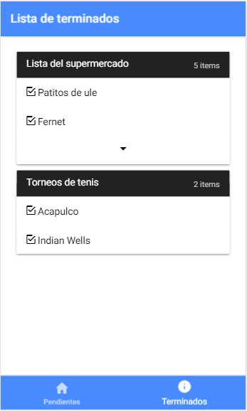
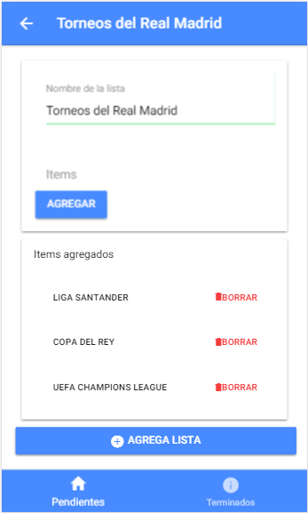

<h1 align="center">
   
  
   
  Aplicación de deseos
   
</h1>

# Descripción

Aplicacion mobile donde los usuarios pueden armar sus propias listas de deseos y ir viendo los pendientes y los completados, se pueden borrar.
Desarrollado con ionic2

Tecnologias usadas:
- Ionic2
- Typescript
- Sass

### Inicio

### Completados

### Agregar Listas

