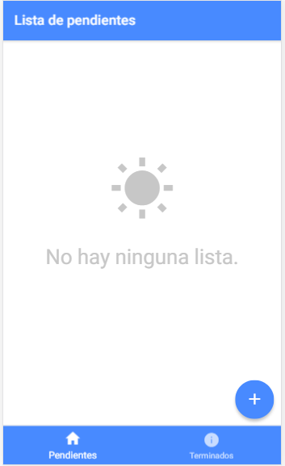

## Aplicacion de deseos

**Descripcion:**
Aplicacion mobile donde los usuarios pueden armar sus propias listas de deseos y ir viendo los pendientes y los completados, se pueden borrar.
Desarrollado con ionic2

**Tecnologias usadas:**
Ionic2, Angular2, Typescript, SASS

Inicio:

Completados:

Agregar Listas:

